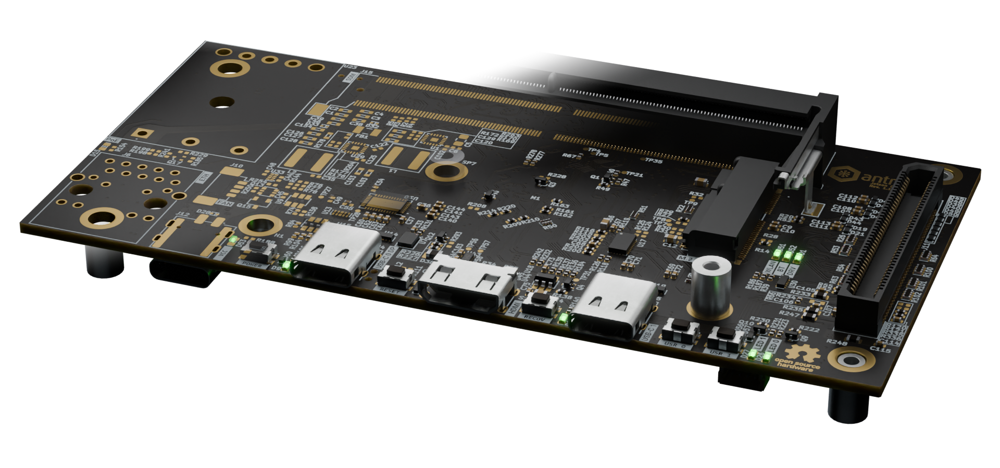

# picknblend

Copyright (c) 2022-2025 [Antmicro](https://www.antmicro.com)



This tool is an open-source utility dedicated to populating 3D models of Printed Circuit Boards (PCBs) with 3D electrical components in Blender (.blend) format.
The tool uses .csv Pick and Place input position files that are used for placing components in proper positions.
This makes the PCB with components visualization independent from the software used for designing it.
Currently `picknblend` supports Blender 4.1+.

## Installation

### Requirements

`picknblend` depends on the following packages:

* python3.11, pipx

Additionally to preview and modify the generated .blend file [Blender 4.1](https://www.blender.org/download/releases/4-1/) needs to be installed.

### Installation (Debian)

1. Install the dependencies:

    ```bash
    sudo apt-get update
    sudo apt install python3.11 python3.11-venv pipx
    ```

2. Configure PATH:

    ```bash
    export PATH=$HOME/.local/bin:$PATH
    ```

3. Clone and install `picknblend`:

    ```bash
    python3.11 -m pipx install 'git+https://github.com/antmicro/picknblend.git'
    ```

## Usage

Please check the [picknblend documentation](https://antmicro.github.io/picknblend/) for more guidelines.

To show available functionalities of `picknblend`, run:

```bash
picknblend --help
```

For more information regarding Blender supported by the `picknblend` visit the [Blender 4.1 documentation](https://docs.blender.org/manual/en/4.1/).

## License

The `picknblend` utility is licensed under the Apache-2.0 [license](LICENSE).
